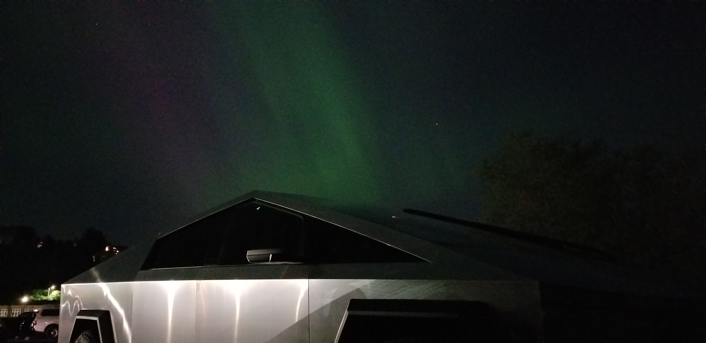
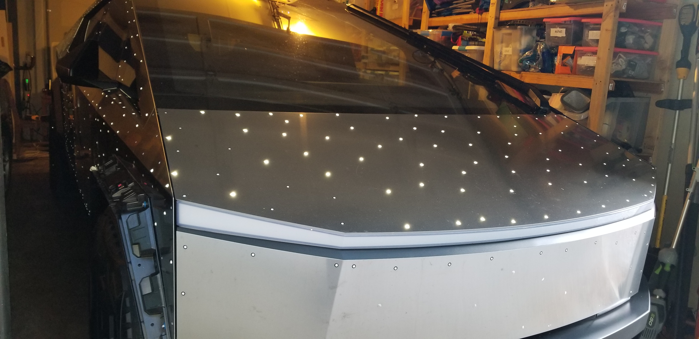
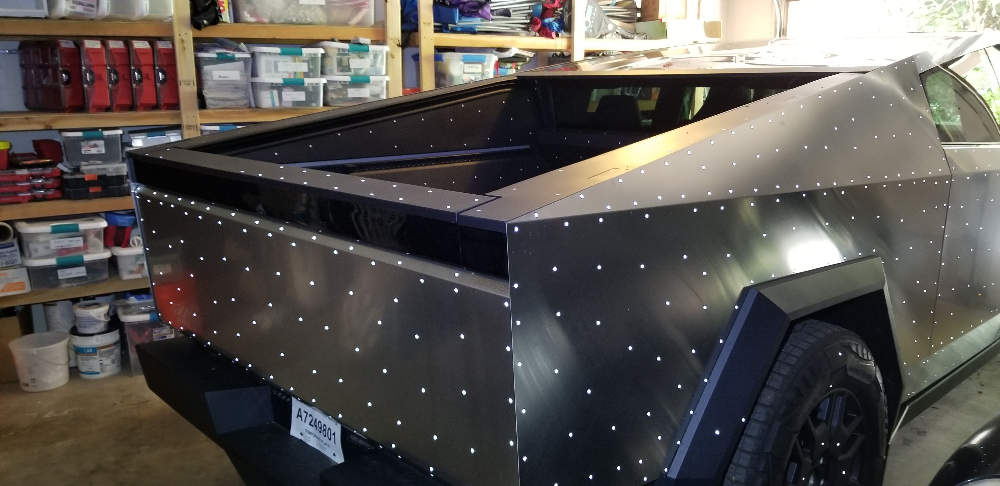
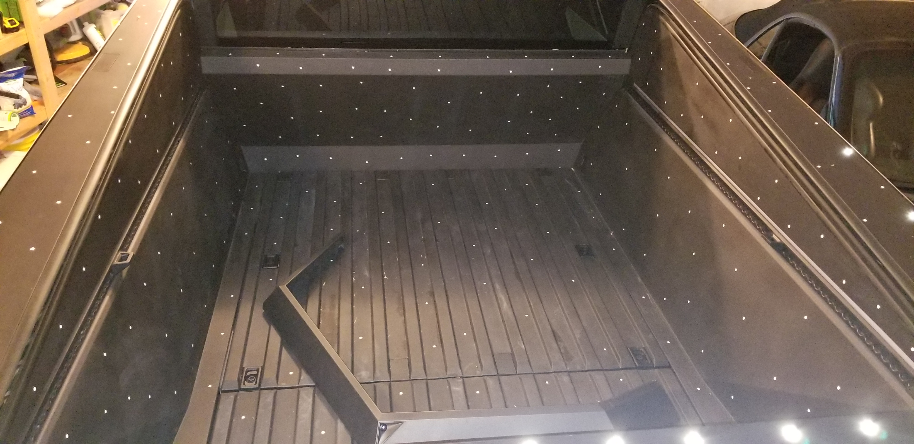
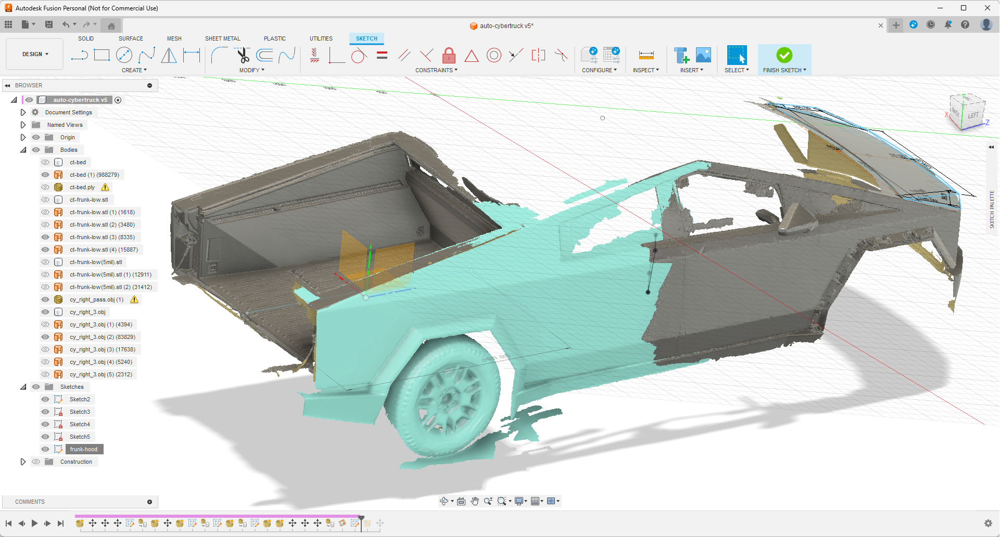
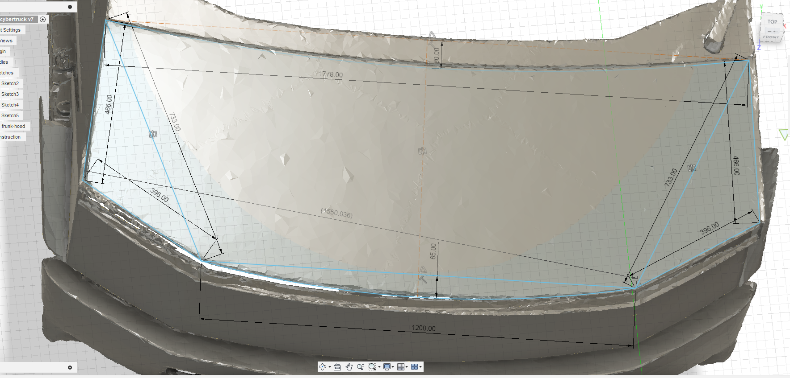
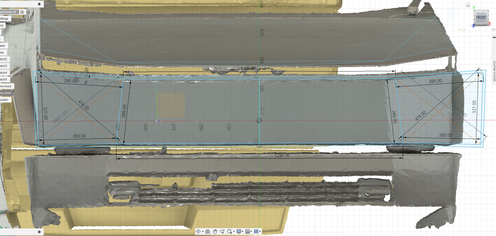
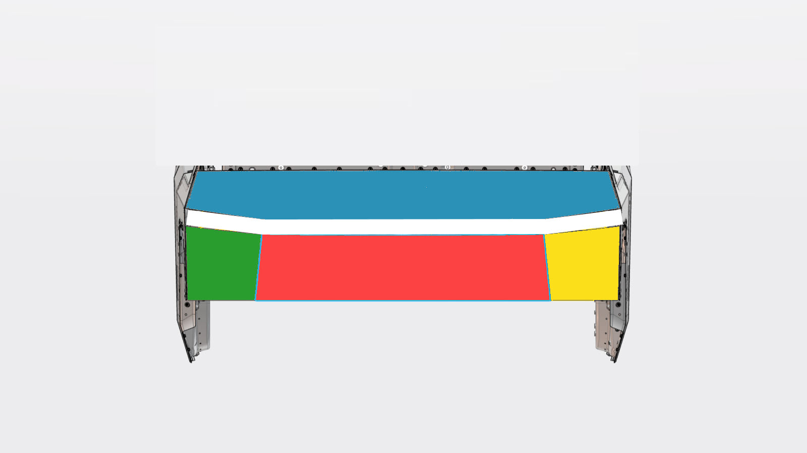
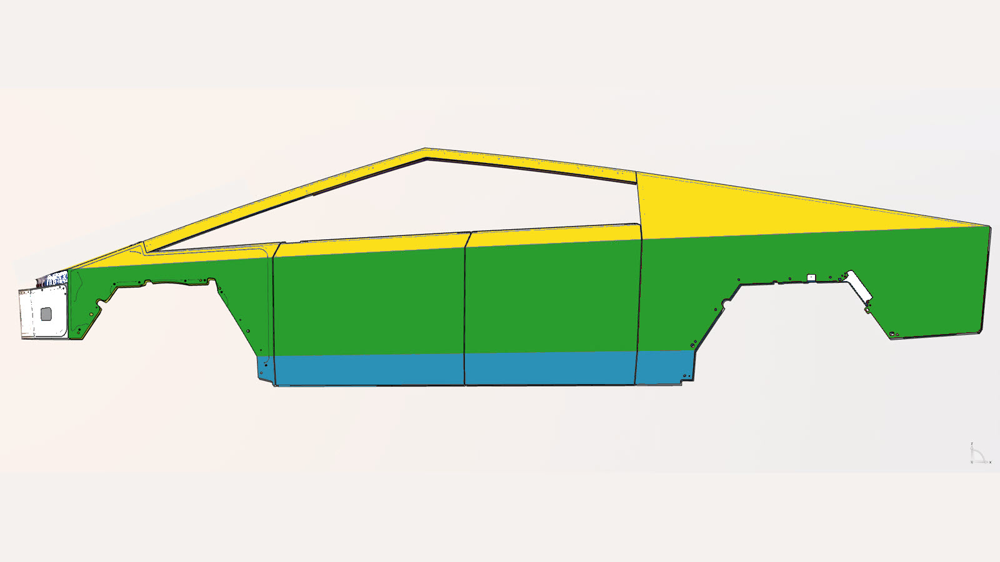
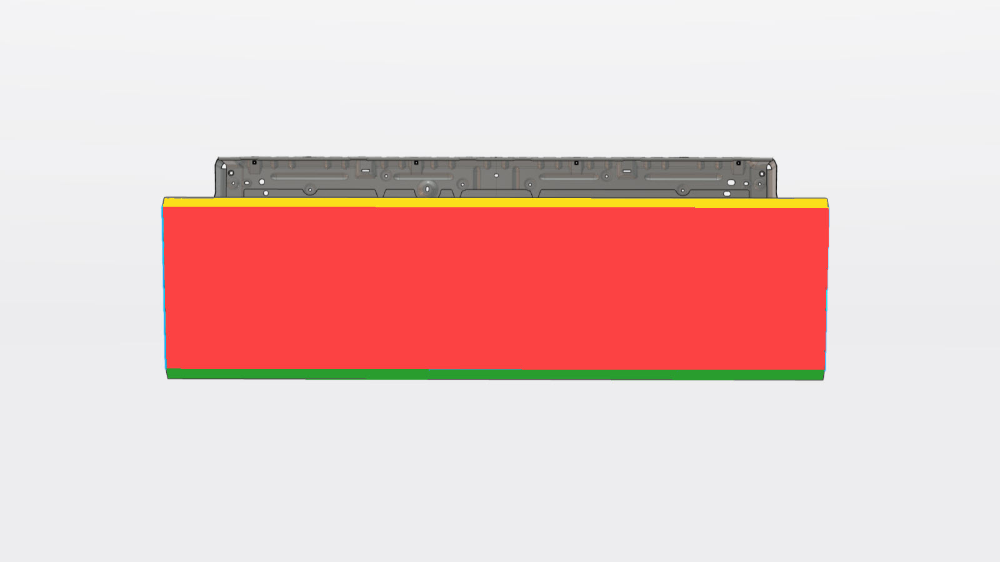

# Cybertruck

Cybertruck related notes, specs, dimensions, mods, references and maybe some code even...

<table><tr>
<td>

</td><td>

</td><td>

</td><td>
</tr></table>

## Dimensions

Couldn't find dimensions on the interwebs that were priced at a point I was willing to pay (e.g. saw prices in $1k range for detailed scans).  So...  Decided to burn cash and time buying and learning to use a 3D scanner, littering the panels with reflective marker dots...  Removing the dots will be a PITA.  Previously used, and still have a PC connected Kinect 3D scanner.  Hardware/software has advanced.  My current setup... 

- $320 [3D scanner](https://www.amazon.com/dp/B0CNVQGVMM)
  - Came with ~400 dots
  - Dancing with the Wired Scanner is PITA.  Note there's a $160 [Creality 3D Scanner CR-Scan Ferret Wireless Scanning Kit, WiFi6 Wireless Bridge](https://www.amazon.com/Creality-Wireless-Kit-Indicators-Consumption/dp/B0D1Y8GW55), consider using if do lots of large scans.
- $17 [Qty 600, 6.0mm 3D Scanning Marker dot reference points](https://www.amazon.com/dp/B09Q86JP3Q)
  - Adhesive on these retroreflective dots is really sticky, much harder to remove than the dots that came with the Creality Ferret SE scanner.  Very time consuming to remove!

<table><tr>
<td>

</td><td>

</td><td>

</td><td>

</td><td>

</td><td>
</tr></table>

### Panel Dimensions

<table>
<tr><td>

</td><td>

<mark>TODO: Add Fusion file if/when someone asks</mark>

</td></tr>

<tr><td>

</td><td>

[frunk-hood.dxf](scan/frunk-hood.dxf)

</td></tr>
<tr><td>

</td><td>

[frunk-front.dxf](scan/frunk-front.dxf)

</td></tr>

</table>

## Reference

- [Tesla's Cybertruck Service Manual](https://service.tesla.com/docs/Cybertruck/ServiceManual/en-us/index.html)
  - _"10 - Body"_ >> _"1010 - Body Panels"_ >> [_"Body Panel (Refinish)"_](https://service.tesla.com/docs/Cybertruck/ServiceManual/en-us/GUID-D33D78C9-9BCD-46CB-885C-52B4F482852C.html) links to [Exterior Stainless Steel Panel Refinishing](https://service.tesla.com/docs/Cybertruck/ServiceManual/en-us/GUID-D33D78C9-9BCD-46CB-885C-52B4F482852C.html), which contains the following helpful profile images.  Assuming (?) actual dimensions haven't changed, maybe these can be used to help calibrate/refine/validate 3D scanned models.

<table><tr>
<td>

  
  [source](https://service.tesla.com/docs/Cybertruck/ServiceManual/en-us/GUID-A882616D-D649-4B76-872C-FC1AA0593259-online-en-US.jpg)

</td><td>

  
[source](https://service.tesla.com/docs/Cybertruck/ServiceManual/en-us/GUID-8C18C379-1B7B-479C-8A33-D59ECE467C45-online-en-US.jpg)

  </td><td>

  
  [source](https://service.tesla.com/docs/Cybertruck/ServiceManual/en-us/GUID-B0A4E246-F54C-4F24-8A0B-BAEBB64DC29D-online-en-US.jpg)

  </td></tr></table>