# Cybertruck

Cybertruck related notes, specs, dimensions, mods, references and maybe some code even...

<table><tr>
<td>

</td><td>

</td><td>

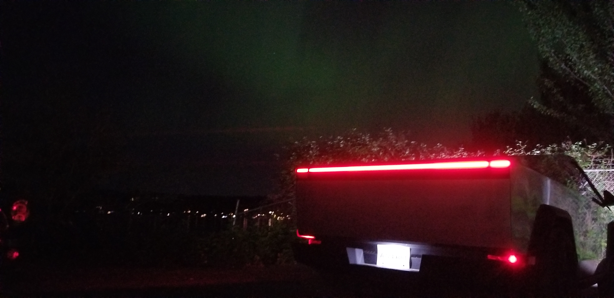

</td><td>
</tr></table>

## Dimensions

Couldn't find dimensions on the interwebs that were priced at a point I was willing to pay (e.g. saw prices in $1k range for detailed scans).  So...  Decided to burn cash and time buying and learning to use a 3D scanner, littering the panels with reflective marker dots...  Removing the dots will be a PITA.  Previously used, and still have a PC connected Kinect 3D scanner.  Hardware/software has advanced.  My current setup... 

- $320 [3D scanner](https://www.amazon.com/dp/B0CNVQGVMM)
  - Came with ~400 dots
  - Dancing with the Wired Scanner is PITA.  Note there's a $160 [Creality 3D Scanner CR-Scan Ferret Wireless Scanning Kit, WiFi6 Wireless Bridge](https://www.amazon.com/Creality-Wireless-Kit-Indicators-Consumption/dp/B0D1Y8GW55), consider using if do lots of large scans.
- $17 [Qty 600, 6.0mm 3D Scanning Marker dot reference points](https://www.amazon.com/dp/B09Q86JP3Q)
  - Adhesive on these retroreflective dots is really sticky, much harder to remove than the dots that came with the Creality Ferret SE scanner.  Very time consuming to remove!

<table><tr>
<td>

</td><td>

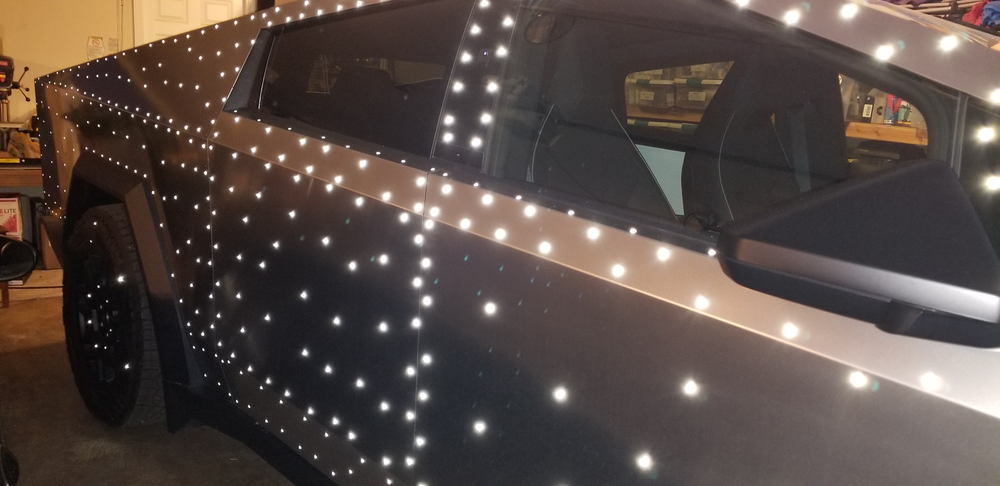

</td><td>

</td><td>

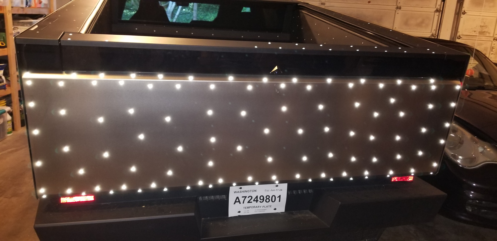

</td><td>

</td><td>
</tr></table>

### Panel Dimensions

Panel Names from [Tesla Service > Cybertruck US > 10 - BODY > 1010 - Body Panels > Closure Panels](https://epc.tesla.com/en-US/catalogs/b685e77a-0f90-4a81-a1a5-3f3417542754/categories/18b8b689-5e5e-4d87-b759-afad9e0beded/subcategories/130fa872-0d60-44c9-9f14-72f4dc4b89fd/systemGroups/90ce547b-790a-4989-83f2-9532d8c9afc1)

<table>

<tr><td>

</td><td>

[Combined layout-5'x60'.dxf](scan/layout-5'x60'.dxf)

</td></tr>

<tr><td>

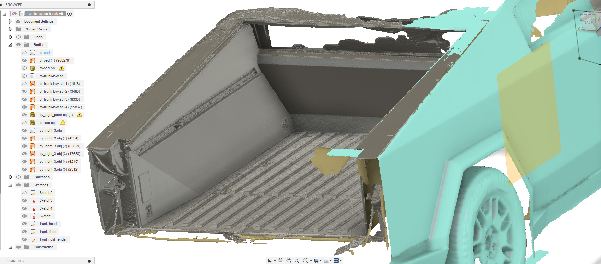

</td><td>

<mark>TODO: Add Fusion file if/when someone asks</mark>

</td></tr>

<tr><td>

</td><td>

- [frunk-hood-rolled.dxf](scan/frunk-hood-rolled.dxf)
- [frunk-hood-edge.dxf](scan/frunk-hood-edge.dxf)

</td></tr>

<tr><td>

</td><td>

- [frunk-front-rolled.dxf](scan/frunk-front-rolled.dxf)
- [frunk-front-edge.dxf](scan/frunk-front-edge.dxf)

</td></tr>

<tr><td>

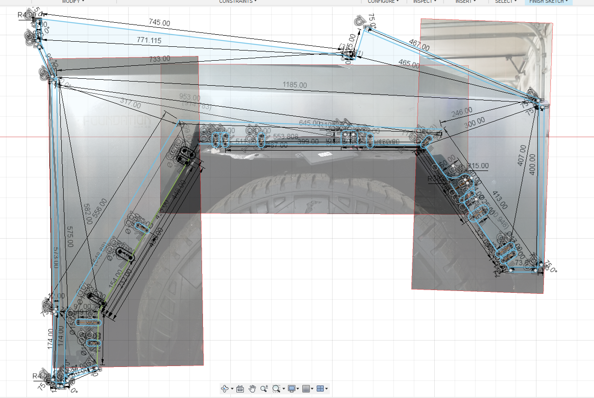

</td><td>

- [front-fenders-rolled.dxf](scan/front-fenders-rolled.dxf)

- [front-fenders-edge.dxf](scan/front-fenders-edge.dxf)

</td></tr>

<tr><td>

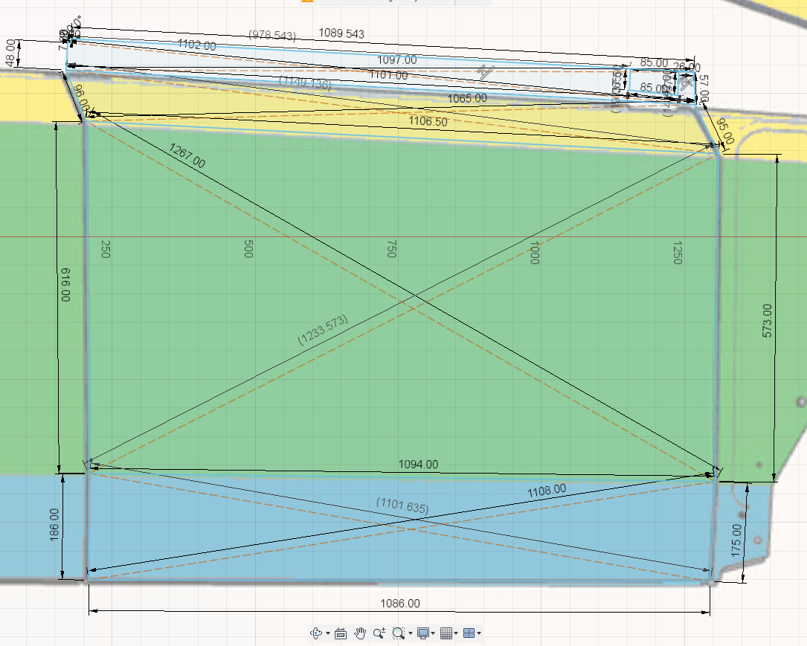

</td><td>

[front-right-passenger.dxf](scan/front-right-passenger.dxf)

</td></tr>

<tr><td>

</td><td>

[rear-right-passenger.dxf](scan/rear-right-passenger.dxf)

</td></tr>

<tr><td>

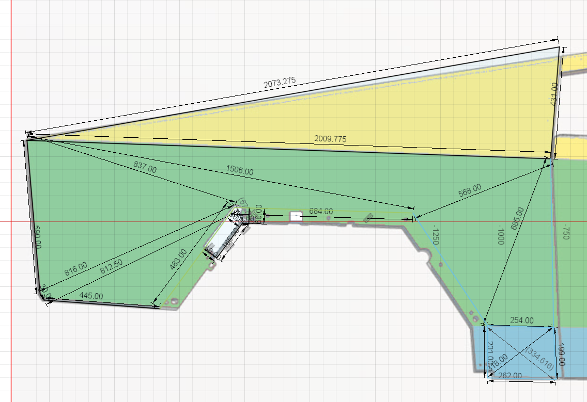

</td><td>

[right-bed-side-outer.dxf](scan/right-bed-side-outer.dxf)

</td></tr>

<tr><td>

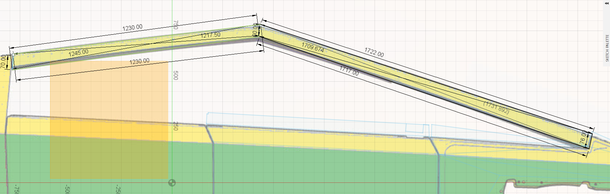

</td><td>

[right-roof-rail-trim.dxf](scan/right-roof-rail-trim.dxf)

</td></tr>

<tr><td>

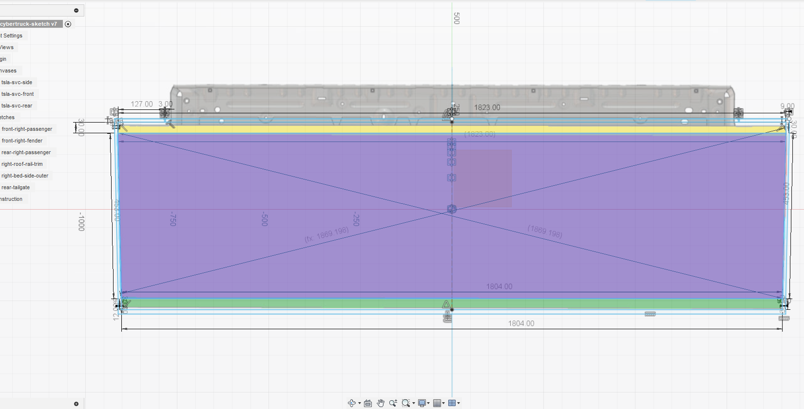

</td><td>

[rear-tailgate-template.dxf](scan/rear-tailgate-template.dxf)

</td></tr>

</table>

TODO:
- Rename Panels to match Tesla Service manual.
- TODO: Remove Markers from 3D Scanned Mesh
- Fix rear right passenger mirror dimensions...
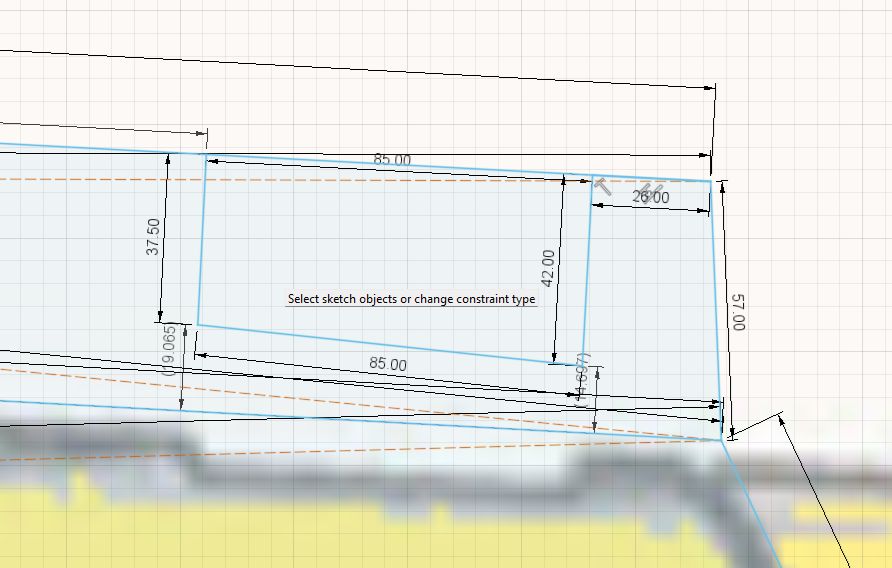

# Cybertruck Wrapping

## Wrap Options
- $1200 kit, limited colors https://cybertruckco.com/product/cybertruckco-precut-ppf-wrap-kits-made-in-the-usa
- $2300 kit, https://tesbros.com/products/diy-protection-ppf-kit-for-cybertruck?variant=45118499848410
- $xxxx kit, https://tsportline.com/collections/tesla-cybertruck-stainless-steel-protection-film-sspf-car-wraps-ceramic-treatment/products/tesla-cybertruck-diy-color-change-vinyl-wrap-kit?utm_medium=product_shelf&utm_source=youtube
  - Great selection of info, prep and videos for [installing vinyl wrap](https://tsportline.com/pages/tesla-diy-wrap-ppf-installation-instructions-and-support#wrap) or [installing ppf wrap](https://tsportline.com/pages/tesla-diy-wrap-ppf-installation-instructions-and-support#ppf).
  - https://www.youtube.com/watch?v=s9qFswHlw1M&t=16s
    - surface prep solution, remove dirt/wax/oil/polish/containemants
    - claybar microfinishing compound
    - microfiber towels
    - Torx 40 for side mirror removal
    - Slip solution (green) Soap with distilled water
    - Stick solution (red) 25% Alcohol with distilled water
    - Squidgee
    - Knives and syringes
    - Install in 70 degree, clean dust free, well lit garage, stool.
    - CLEAN EVERYTHING, INSIDE and OUTSIDE, CLEANS NOOKS AND CRANNYS.

## Removing Parts for wrapping

- Removing [Fender flares](https://epc.tesla.com/en-US/catalogs/b685e77a-0f90-4a81-a1a5-3f3417542754/categories/18ebc72e-92dc-4af3-b468-88274cf3961f/subcategories/302683a0-1065-4f6a-9e78-fc3ac973e2b6/systemGroups/e3a06599-e46f-41af-8017-109d6cac00aa
).
  - Fender flares are attached to [Wheel Arch Liners](https://epc.tesla.com/en-US/catalogs/b685e77a-0f90-4a81-a1a5-3f3417542754/categories/18ebc72e-92dc-4af3-b468-88274cf3961f/subcategories/549d6bb6-abca-41d7-afb6-c9668575b643/systemGroups/d19152cf-2ee7-480e-9334-d301ba86a7f2) using [RVT PUSH - PULL 8X18X20.0 0M1M 1006521-00-A] fasteners.
  
  - **NOTE:**  Observed some _Wrappers_ go so far as to remove the [FORE FENDER FLARE CARRIERS] attached ([M6 x24](BLT,HF,M6X24[88],G1009,NJ,TU01
1946638-00-A) ) to the stainless steel closure panels.
    - TODO:  Decide whether to do the same.  24/5/19, currently just been sketching assuming just Fender Flare cover is being removed.
    - Java Kim visits TSportLine https://www.youtube.com/watch?v=csHHjPKi18g
      - Inozetek film
      - 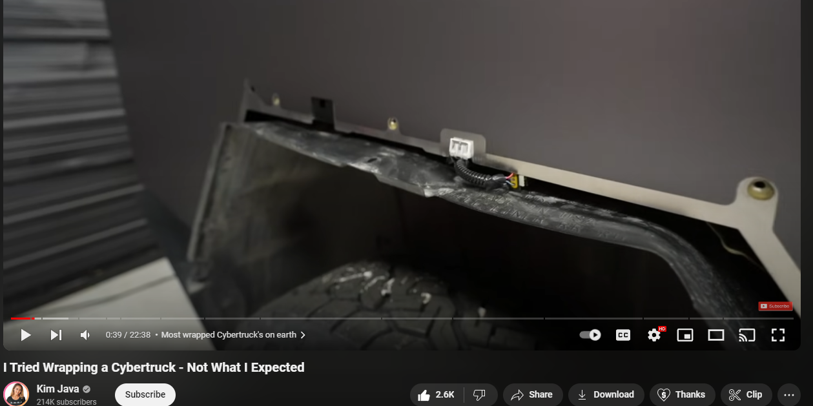
      - 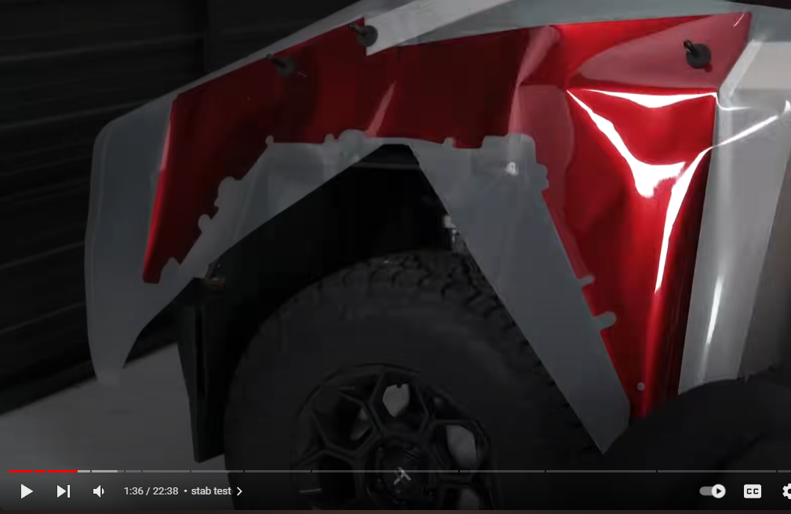

### Bed Side Outer Panels

Rolling edges of [Bed Side Outer Panels] requires either tucking film into some tight spots.  Or, alternatively, you can burn time and maybe break/lose some parts like me and remove some of the trim pieces to help roll film edges large enough to not worry about peeling later...

- #### Trim parts to remove:
  - [Cybertruck Parts > 12 - EXTERIOR FITTINGS > 1220 - Exterior Trim > Truck Bed Exterior Trim](https://epc.tesla.com/en-US/catalogs/b685e77a-0f90-4a81-a1a5-3f3417542754/categories/18ebc72e-92dc-4af3-b468-88274cf3961f/subcategories/302683a0-1065-4f6a-9e78-fc3ac973e2b6/systemGroups/6e5a9888-fd19-49fd-8878-9a40a1dbde81)
    - [Remove BED SIDE APPLIQUE ASSEMBLY by pulling up starting near tail gate](https://service.tesla.com/docs/Cybertruck/ServiceManual/en-us/GUID-415D63EA-024A-4B3D-8BC7-78356E4B7F71.html).
      - Follow service docs, additionally, AVOID overly bending the easy to snap/break Bed Side Applique.
      - Left and right sides each use 10x "DGE CLIP,6MM,1.5-2.5GRP,POM,WH 1496105-00-B".  Mentioning, because I 8/10 dropped into bed side voids during disassembly.  Retrieving requires removing more panels, nope...  They're just $1 each.
  - [Cybertruck Parts > 12 - EXTERIOR FITTINGS
  1220 - Exterior Trim > Exterior Trim Fittings](https://epc.tesla.com/en-US/catalogs/b685e77a-0f90-4a81-a1a5-3f3417542754/categories/18ebc72e-92dc-4af3-b468-88274cf3961f/subcategories/302683a0-1065-4f6a-9e78-fc3ac973e2b6/systemGroups/41188d7c-d97b-4cd0-8fda-2a5a55c6ab79)
    - Remove couple of the trim pieces between rear doors and bed side outer panels to help expose enough panel edge for rolling the film.
      - Remove BED SIDE BAFFLE APPLIQUE ( 1776409-00-D, 1776410-00-D), see [Remove/install "Sail Baffle Applique"](https://service.tesla.com/docs/Cybertruck/ServiceManual/en-us/GUID-109A484A-F96A-4244-8E2A-A2006CFC7729.html)
      - Remove SAIL BAFFLE CLOSEOUT (1848587-00-D, 1848588-00-D), see [Remove/install "Saile Baffle Closeout](https://service.tesla.com/docs/Cybertruck/ServiceManual/en-us/GUID-68C6F358-F23C-47EB-A1DA-C53783D0C6FA.html)

  ## Replacing Parts broken during wrapping

- $15 (1776410-00-D) BED SIDE BAFFLE APPLIQUE - RIGHT HAND
  - Broke 2/3 clip mounts during disassembly, so I replaced the part.
- $1 each (lost ~8), (1496105-00-B) EDGE CLIP,6MM,1.5-2.5GRP,POM,WH

   

- How to remove/assemble side mirrors [Exterior Mirrors - Exterior Mirror Assembly - Electromechanical - LH (Remove and Install)](https://service.tesla.com/docs/Cybertruck/ServiceManual/en-us/GUID-E5FC5791-2CCB-49E2-A210-2300460B0063.html)

## Reference

- [Tesla's Cybertruck Service Manual](https://service.tesla.com/docs/Cybertruck/ServiceManual/en-us/index.html)
  - _"10 - Body"_ >> _"1010 - Body Panels"_ >> [_"Body Panel (Refinish)"_](https://service.tesla.com/docs/Cybertruck/ServiceManual/en-us/GUID-D33D78C9-9BCD-46CB-885C-52B4F482852C.html) links to [Exterior Stainless Steel Panel Refinishing](https://service.tesla.com/docs/Cybertruck/ServiceManual/en-us/GUID-D33D78C9-9BCD-46CB-885C-52B4F482852C.html), which contains the following helpful profile images.  Assuming (?) actual dimensions haven't changed, maybe these can be used to help calibrate/refine/validate 3D scanned models.

<table><tr>
<td>

  
  [source](https://service.tesla.com/docs/Cybertruck/ServiceManual/en-us/GUID-A882616D-D649-4B76-872C-FC1AA0593259-online-en-US.jpg)

</td><td>

  
[source](https://service.tesla.com/docs/Cybertruck/ServiceManual/en-us/GUID-8C18C379-1B7B-479C-8A33-D59ECE467C45-online-en-US.jpg)

  </td><td>

  
  [source](https://service.tesla.com/docs/Cybertruck/ServiceManual/en-us/GUID-B0A4E246-F54C-4F24-8A0B-BAEBB64DC29D-online-en-US.jpg)

  </td></tr></table>