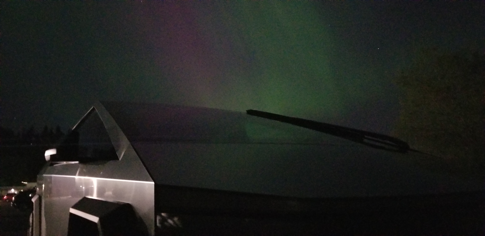

# Cybertruck

Cybertruck related notes, specs, dimensions, mods, references and maybe some code even...

<table><tr>
<td>

</td><td>

</td><td>

</td><td>
</tr></table>

## Dimensions

Couldn't find dimensions on the interwebs that were priced at a point I was willing to pay.

So, I burned way more cash and time buying a scanner and reflective marker dots...
- [3D scanner](https://www.amazon.com/dp/B0CNVQGVMM)
  - Wired is PITA to work with.  There's a $150 kit for wireless, consider using if do lots of large scans.
  - Comes with 
- [6.0mm 3D Scanning Marker dot reference points](https://www.amazon.com/dp/B09Q86JP3Q)
  - Adhes

<table><tr>
<td>

</td><td>

</td><td>

</td><td>

</td><td>

</td><td>
</tr></table>

### Panel Dimensions

